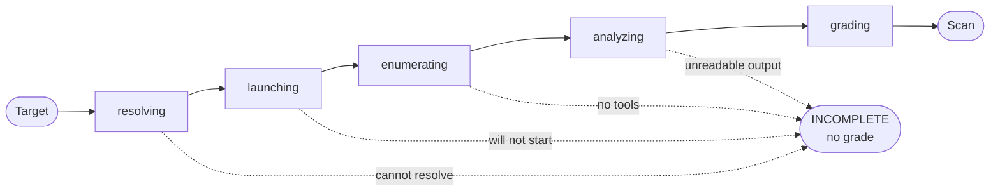
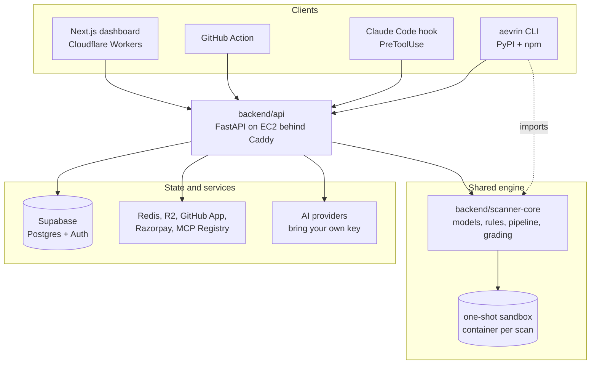

<div align="center">


<h1>Aevrin</h1>

<p><b>Know what an MCP server can do to you, before your agent installs it.</b></p>

<p>
Aevrin starts a Model Context Protocol server inside a sandbox, reads the tools it actually
exposes, and grades what it finds. When it cannot establish something, it says so instead of
returning a clean result.
</p>

[](https://github.com/aevrin-projects/aevrin-mcp-scanner/actions/workflows/ci.yml)
[](https://github.com/aevrin-projects/aevrin-mcp-scanner/actions/workflows/codeql.yml)
[](https://pypi.org/project/aevrin/)
[](https://www.npmjs.com/package/aevrin)
[](LICENSE)

[Documentation](https://docs.mcp.aevrin.net) &nbsp;&middot;&nbsp;
[Marketplace](https://app.mcp.aevrin.net/marketplace) &nbsp;&middot;&nbsp;
[CLI reference](docs/reference/CLI.md) &nbsp;&middot;&nbsp;
[Architecture](docs/architecture/OVERVIEW.md)

</div>

---

## The problem

An MCP server is a program your agent is allowed to call. Installing one is closer to running
`curl | sh` than to adding a library: `npx -y some-mcp-server` downloads a package, runs its
install scripts, and hands an agent a set of tools whose descriptions the model will trust.

Nothing about the repository tells you whether that is safe. A project can be MIT licensed,
well tested and beautifully documented while the package it publishes exposes a tool that runs
arbitrary shell commands. Only one of those facts matters once the agent calls the tool.

Aevrin assesses the **running server**, not the repository that happens to contain its source.

## Quick start

```bash
pip install aevrin        # or: npm install -g aevrin
aevrin login
aevrin scan mcp "npx -y @playwright/mcp"
```

A scan of a six-tool server, two of whose tools can execute code, prints this:

```
Target: npx -y demo-mcp

C   Risk score: 27/100   Caution
2 Critical   3 Low   11 Info

Risk summary
Needs Approval

Arbitrary Code Execution and Missing Rate Limits raise enough risk that this
server should not be trusted automatically.

Potential impact: Anything that can influence this tool's arguments can run
code with the MCP process's own permissions - its files, its environment
variables, its network position.
Recommended action: Require approval for the tools named below, and re-scan
once their permissions are narrowed.
Suggested policy: REQUIRE APPROVAL

Security findings (16)

CRITICAL  AS-006  Arbitrary Code Execution
  Affected tools: evaluate_script
  Evidence: tool_name_keyword: evaluate_script
  Why this matters: ...
  Fix: Remove the tool unless it is genuinely required. If it stays: restrict
  it to trusted callers, require human approval before each invocation ...
```

Every finding carries the rule that fired, the tools it affects, the evidence behind it, why it
matters and what to change. `--json` gives the same result machine-readable.

Scanning needs Docker locally, because the server is started in a container that assumes it is
hostile. Without Docker, use `--remote` to run the scan on Aevrin's infrastructure, or scan a
hosted endpoint directly:

```bash
aevrin scan https://mcp.context7.com/mcp
```

## Why it is built this way

**A missing grade is a state, not a default.** A scan that could not launch a server, or that
launched it and read no tools, is `INCOMPLETE` and carries no letter. It is never reported as
`ALLOW`. Zero findings from a server nobody could read looks exactly like a perfect server, and
that indistinguishability is the failure this project exists to avoid.

**One engine, one verdict.** The security engine is the
[ToolTrust Scanner](https://github.com/AgentSafe-AI/tooltrust-scanner) (MIT), pinned by version
and SHA-256. Aevrin does not decide what a vulnerability is, how severe it is, or what grade a
tool earns. There is no second grader and no severity-weight table anywhere in this repository,
so the dashboard, the terminal, CI and the marketplace cannot disagree about the same server.

**The worst tool decides the grade.** The engine grades per tool, and its own average cannot be
shown to anyone: on a real run, a five-tool server whose `run_shell` tool carried a Critical
tool-poisoning finding averaged out to grade A. You install the whole server, so the worst tool
is the grade.

**The command is never guessed from the repository name.**
`github.com/microsoft/playwright-mcp` publishes as `@playwright/mcp`. A different, unrelated
`playwright-mcp` also exists on npm. Resolving by slug would scan the wrong package and
attribute the grade to Microsoft, and the report would look entirely normal. Commands come from
the project's own manifest, or from you.

## Surfaces

The same pipeline, the same findings and the same grade, reached five ways. `invocation_channel`
records which one asked; it never changes the result.

| Surface | How you use it |
|---|---|
| **CLI** | `aevrin scan mcp "npx -y @playwright/mcp"` |
| **Dashboard** | Scan history, triage, findings, agent posture, team workspace |
| **Claude Code hook** | `PreToolUse` block on an install that would bring in a high-risk server |
| **CI** | A [GitHub Action](action.yml) that fails the build on serious findings |
| **MCP server** | `aevrin mcp-server`, so an agent can check a server before installing it |

Aevrin also runs a public [marketplace](https://app.mcp.aevrin.net/marketplace) of MCP servers
ingested from the official [MCP Registry](https://registry.modelcontextprotocol.io), each
carrying a real scan, a grade bound to the exact version scanned, and the findings that earned
that grade.

## How a scan runs



Five stages, because those are the five things that happen. A scan that stops early stops at a
named stage with a reason attached, and is never reported as completed with zero findings.

| Stage | What it does |
|---|---|
| `resolving` | Work out the command that starts this server, from a manifest or from you |
| `launching` | Start it, in a container that assumes it is hostile |
| `enumerating` | Complete the MCP handshake and read its tool definitions |
| `analyzing` | Run the rules (AS-001 to AS-018, mapped to the OWASP MCP Top 10) |
| `grading` | Roll per-tool verdicts up to the worst tool, write the summary |

### The sandbox

Reading a server's tools means starting it, which means executing code chosen by whoever
published the package, including npm install scripts. The API process holds a Supabase
service-role key that bypasses RLS, so the server never runs beside it. It runs in a one-shot
sibling container with no Aevrin environment, a read-only rootfs, uid 10002, every capability
dropped, `no-new-privileges`, memory, CPU and pid ceilings, and a hard timeout.

Two limits are stated rather than glossed. Network egress cannot be removed, because the package
has to be downloaded; on the deployed host, EC2 IMDSv2 with `HttpPutResponseHopLimit=1` is what
refuses a request from behind Docker's NAT, and that is a deployment precondition rather than
something this code enforces. `noexec` is not set on the tmpfs mounts, because `npx` execs shims
it installs there; isolation comes from the container holding no credentials and being destroyed.

There is no non-Docker fallback. An unavailable sandbox is an unavailable scan, never a scan
performed without one.

## Architecture



`scanner-core` is the load-bearing piece. Both `backend/api` and `backend/cli` import it, so a
finding reads identically on the dashboard, in the terminal and in a hook block message. Nothing
above it re-implements a model, a rule or a grade.

Layer direction is enforced rather than documented and hoped for. The backend runs
`routes -> controllers -> services -> db/integrations/config/core` and never imports upward. The
frontend uses [Feature-Sliced Design](https://feature-sliced.design)
(`app -> views -> widgets -> features -> entities -> shared`), with the direction checked by
`eslint.config.mjs` as a lint error.

## Repository layout

```
backend/
  scanner-core/    The engine. Models, rules, pipeline, grading. Never imports upward.
  api/             FastAPI: scans, marketplace, billing, AI, admin, auth.
  cli/             The `aevrin` CLI, published to PyPI.
  cli-npm/         npm wrapper that installs the Python CLI.
  hook/            Claude Code PreToolUse hook.
  scanner-image/   The sandbox image, with the engine pinned by SHA-256.
  infra/           Supabase migrations.
  deploy/          Caddyfile and the EC2 deploy script.
frontend/          Authenticated dashboard, admin, settings, marketplace.
frontend-public/   Public marketing site (static export).
frontend-docs/     Docs site at docs.mcp.aevrin.net (fumadocs, static export).
docs/              Engineering documentation for this repository.
```

## Running it locally

Requires Python 3.11+ with [uv](https://docs.astral.sh/uv/), Node 22, and Docker for scanning.
(The CLI and `scanner-core` themselves support Python 3.10+; the API needs 3.11.)

```bash
# API, needs backend/api/.env
cd backend/api && uv run uvicorn aevrin_api.main:app --reload

# Dashboard, expects the API on http://localhost:8000
cd frontend && npm install && npm run dev

# CLI, straight from the source tree
cd backend/cli && uv run aevrin scan mcp "npx -y @playwright/mcp"
```

Every environment variable is declared in one `Settings` model and documented in
[`docs/reference/ENVIRONMENT.md`](docs/reference/ENVIRONMENT.md).

### Tests

```bash
cd backend/scanner-core && uv run ruff check . && uv run mypy aevrin_scanner_core && uv run pytest
cd backend/api         && uv run ruff check . && uv run mypy aevrin_api          && uv run pytest
cd backend/cli         && uv run ruff check . && uv run mypy aevrin_cli          && uv run pytest
cd frontend            && npx eslint src && npx tsc --noEmit && npm run build
```

See [`docs/testing/TESTING.md`](docs/testing/TESTING.md) for what each suite covers and what CI
gates on.

## Use it in CI

```yaml
- uses: aevrin-projects/aevrin-mcp-scanner@v0.5.0
  with:
    server-command: npx -y @playwright/mcp
    api-key: ${{ secrets.AEVRIN_API_KEY }}
    fail-on: high
```

Exit code `3` means the scan could not be trusted, and it is surfaced as a workflow error rather
than a green tick. A scan that never assessed anything must never look like a clean pass.

## Documentation

| Question | Where |
|---|---|
| How do I use the product? | [docs.mcp.aevrin.net](https://docs.mcp.aevrin.net) |
| Every CLI command and exit code | [`docs/reference/CLI.md`](docs/reference/CLI.md) |
| How the system fits together | [`docs/architecture/OVERVIEW.md`](docs/architecture/OVERVIEW.md) |
| How a scan actually runs | [`docs/features/MCP_SCANNING.md`](docs/features/MCP_SCANNING.md) |
| Auth, tenancy, secrets, SSRF | [`docs/security/SECURITY.md`](docs/security/SECURITY.md) |
| Schema and RLS model | [`docs/architecture/DATABASE.md`](docs/architecture/DATABASE.md) |
| Why something is built this way | [`DECISIONS.md`](DECISIONS.md) |
| What shipped, and when | [`CHANGELOG.md`](CHANGELOG.md) |

## Contributing

Contributions are welcome. Start with [`CLAUDE.md`](CLAUDE.md), which is the entry point for
anyone working in this repository: it holds the engineering rules, the reading order, and the
documentation contract a change is expected to keep. [`AGENT.md`](AGENT.md) is the operational
companion covering how to research, test and report.

Two rules matter more than the rest. Do not add a second finding, scan or grading model, because
everything imports `scanner-core` so that a finding means one thing everywhere. Do not report a
result the code did not establish, because a wrong security finding is worse than a missing
feature.

To report a vulnerability in Aevrin itself, see [`SECURITY.md`](SECURITY.md).

## License

[MIT](LICENSE). The ToolTrust Scanner is MIT licensed and used unmodified; see
[`backend/scanner-core/EXTERNAL_SCANNERS.md`](backend/scanner-core/EXTERNAL_SCANNERS.md) for
third-party provenance.

A licence shown on a marketplace listing is the MCP publisher's licence for their software, and
is unrelated to Aevrin's own.
